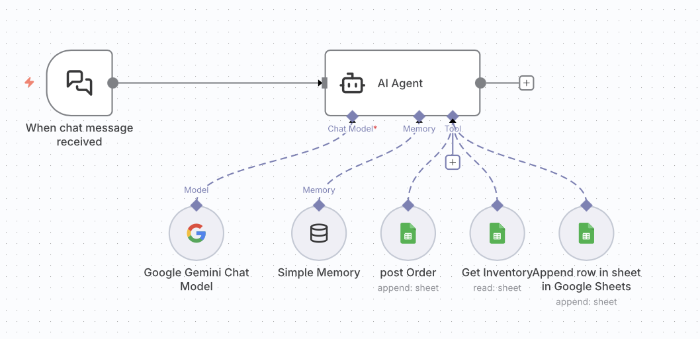
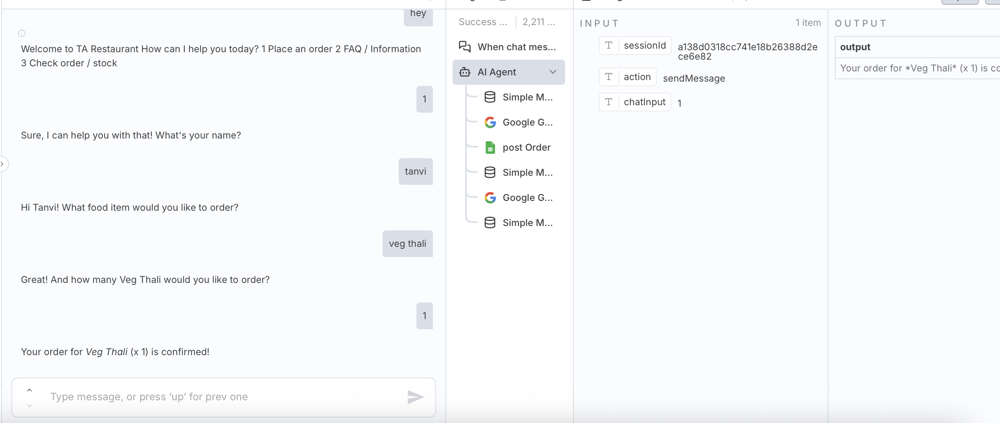

# 🍽️ AI Inventory Management Chat System (n8n)

This project is a **conversational AI inventory management system** built using n8n.  
It enables users to track stock, manage orders, and access FAQs through a natural chat interface.

It integrates **Google Gemini**, **Google Sheets**, and conversational memory to create a real-time operational assistant for restaurants, cafés, and cloud kitchens.

---

## 🚀 Overview

The system allows users to interact with inventory data using chat messages:

- Check stock levels  
- Record new orders  
- Access FAQs instantly  
- Maintain conversational context  

It transforms traditional inventory systems into a **chat-based AI assistant**.

---

## ⚙️ System Architecture

Chat Trigger → Gemini AI Agent → Memory Layer → Google Sheets (Inventory / Orders / FAQ)

---
## 📸 Workflow Screenshots

### ⚙️ 1. Inventory Chat Workflow Design

---

### 🤖 2. AI Chat Output / System Response

---

## 🔄 Workflow Breakdown

---

## A. 💬 Interactive Inventory Chat Flow

### 🔁 Flow
Chat Trigger → AI Agent (Gemini + Memory + Google Sheets Tools)

### 🧠 Description

- **Chat Trigger Node** — activates workflow on user message input  
- **AI Agent Node** — core intelligence layer powered by Gemini  

It includes:

- 🤖 **Gemini Chat Model**
  - Understands user intent (stock check, order, FAQ)
  - Generates natural responses

- 🧠 **Simple Memory**
  - Maintains conversation context
  - Ensures smooth multi-turn interaction

- 📊 **Google Sheets Tools**
  - **FAQ Sheet** → answers common queries  
  - **Inventory Sheet** → real-time stock tracking  
  - **Record Order Sheet** → logs orders with timestamps  

### 🎯 Purpose
Enables a fully conversational interface for managing inventory and orders.

---

## 🎯 Outcome

A fully functional AI-powered inventory assistant that:

- 💬 Handles natural language queries  
- 📊 Tracks live inventory via Google Sheets  
- 🧾 Records orders automatically  
- ❓ Answers FAQs instantly  
- 🧠 Maintains conversation context  

---

## 🧠 Key Technologies

- n8n Automation  
- Google Gemini API  
- Google Sheets API  
- Conversational Memory (AI Agent)  
- Chat-based Workflow Design  

---